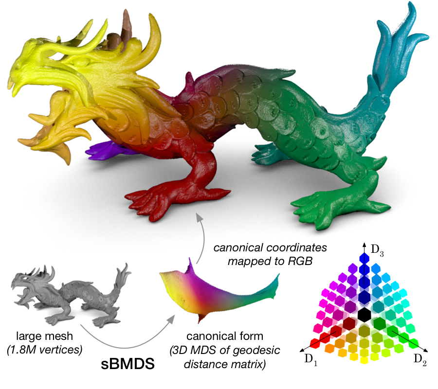

# BHA
Biharmonic matrix approximation (BHA) is a sparse method for efficiently representing geodesic distance matrices (or other symmetric matrices defined over 3D manifolds) using biharmonic interpolation. These representations can be used to (very efficiently) do multidimensional scaling (MDS) on geodesic distance matrices by the Biharmonic MDS (BMDS) method.



_Model: [XYZ RGB Asian Dragon](http://graphics.stanford.edu/data/3Dscanrep/)_

## Get started
```
pip install -U cython numpy
pip install -r requirements.txt

python bha/test_bha_mesh.py
```
This will install the relevant dependencies (so you might want to do it in a virtual environment!) and run an example.

## Performance Notes
The best runtime performance results in parallel systems is achieved with scikit-sparse.
All results in the paper were run with this library.
```
pip install -U scikit-sparse
```

## Citation
If you use or extend BHA, please cite the [BHA paper](http://openaccess.thecvf.com/content_cvpr_2018/papers/Turek_Efficient_Sparse_Representation_CVPR_2018_paper.pdf):

_Turek, J. S., & Huth, A. G. (2018). Efficient, sparse representation of manifold distance matrices for classical scaling. In Proceedings of the IEEE Conference on Computer Vision and Pattern Recognition (pp. 2850-2858)._

bibtex:
```bibtex
@InProceedings{Turek_2018_CVPR,
author = {Turek, Javier S. and Huth, Alexander G.},
title = {Efficient, Sparse Representation of Manifold Distance Matrices for Classical Scaling},
booktitle = {The IEEE Conference on Computer Vision and Pattern Recognition (CVPR)},
month = {June},
year = {2018}
}
```
